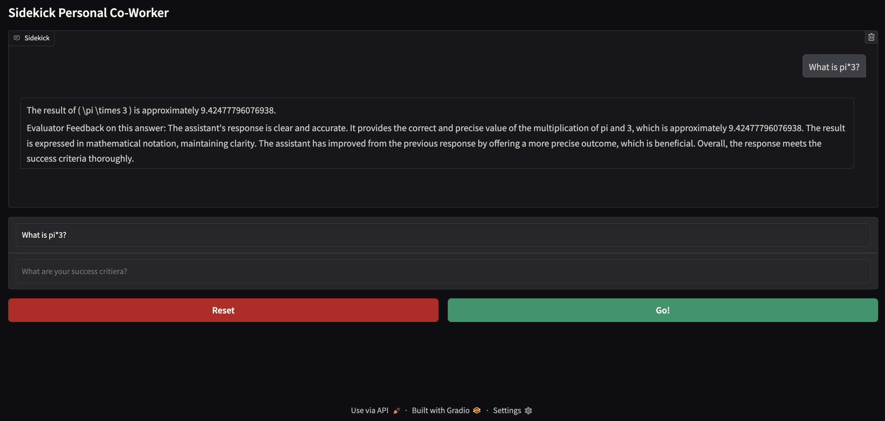
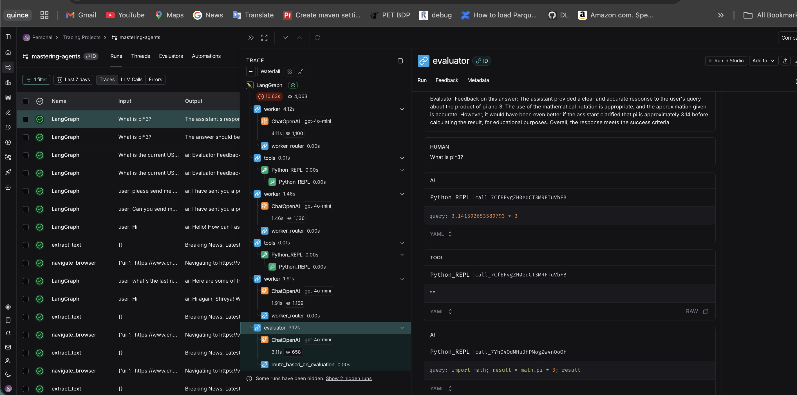
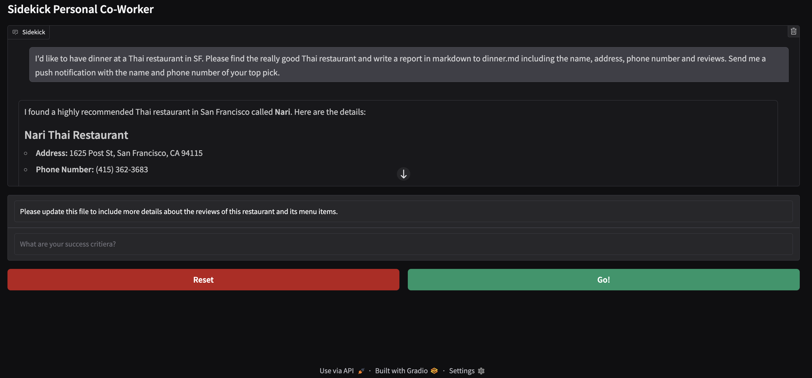

# Sidekick: LangChain + Gradio Agent Assistant

This project implements an interactive agent assistant called **Sidekick**, built using **LangChain**, **LangGraph**, and a **Gradio** web UI.
The system combines LLM reasoning with a structured workflow and a set of useful tools (browser automation, file tools, search, Python execution, etc.).

## Project Structure

| File                  | Purpose                                                                                                                         |
| --------------------- | ------------------------------------------------------------------------------------------------------------------------------- |
| **sidekick_tools.py** | Defines the tools the agent can use (browser automation, search, file operations, notifications, Python REPL, etc.)             |
| **sidekick.py**       | Implements the Sidekick agent: its state machine, message handling, tool-calling behavior, and execution logic using LangGraph. |
| **app.py**            | Launches a Gradio UI and connects the UI to the Sidekick agent for interactive use.                                             |

---

## How It Works

### 1. Tooling (`sidekick_tools.py`)

This module sets up the runtime capabilities available to the agent. It loads environment configuration and creates a unified list of **LangChain Tool** objects, including:

* **Browser Automation** via Playwright (allows the agent to browse and interact with the web)
* **File Management Tools** for uploading, reading, writing, and manipulating local files
* **Web Search** using Google Serper
* **Wikipedia Query Tool** for structured knowledge lookup
* **Python REPL Tool** to execute Python code dynamically
* **Push Notification Tool** (via Pushover API) to send mobile alerts

These tools are returned as a list and later attached to the agent inside `sidekick.py`.

---

### 2. Agent Logic (`sidekick.py`)

This file defines the **Sidekick** agent using **LangGraph**, which allows the agent to operate as a stateful graph rather than a simple chat loop. Key features:

* Maintains conversation **state/history**
* Uses **ChatOpenAI** as the reasoning model
* Integrates the tools from `sidekick_tools.py` via a **ToolNode**
* Supports multi-step reasoning via a `run_superstep` function, allowing the agent to:

  1. Interpret a user request
  2. Decide whether to call a tool
  3. Execute the tool and process the result
  4. Continue reasoning until output is ready
* Includes resource cleanup for browser/playwright sessions

This design lets the agent perform workflows rather than just respond with text.

---

### 3. User Interface (`app.py`)

The UI is built using **Gradio**. It:

* Instantiates and initializes the Sidekick agent
* Provides an interactive text interface
* Sends each message to `sidekick.run_superstep(...)`
* Displays the agent’s output along with updated conversation state

This enables a smooth, chat-like experience in the browser.

---

## Running the App

1. Ensure required environment variables (e.g., API keys) are available in `.env`
2. Install dependencies:

   ```bash
   pip install -r requirements.txt
   ```
3. Run the UI:

   ```bash
   python app.py
   ```
4. Open the Gradio link and interact with the Sidekick agent.

---

## Summary

This project combines:

* **LangGraph** for structured agent reasoning
* **LangChain** tool integration
* **Playwright / Serper / Wikipedia / File tools / Python REPL** for agent capabilities
* **Gradio** for a simple, interactive chat interface

The result is a flexible, extensible agent capable of performing real tasks—not just chatting.

---------

# Example Outputs

## 1a) Asking agent to comput pi*3


## 1b) Trace showing evaluator giving feedback and agent improving its calculation of pi  


## 2a) Asking agent to find the best thai restaurants in SF, persist a report in `dinner.md` and send me push notification with the name and number of the top restaurant.


## 2b) Asking agent to update the report in dinner.md with a summary of the reviews and menu items


## 2c) push notification
